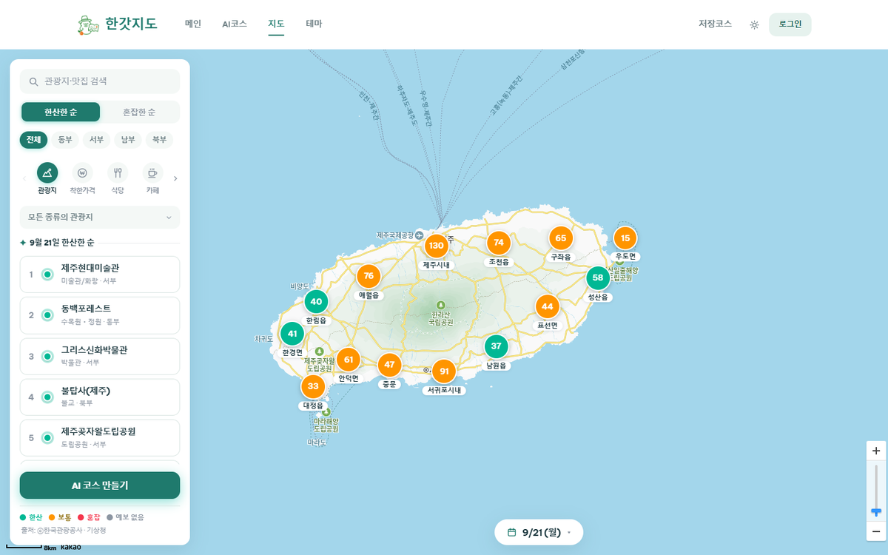
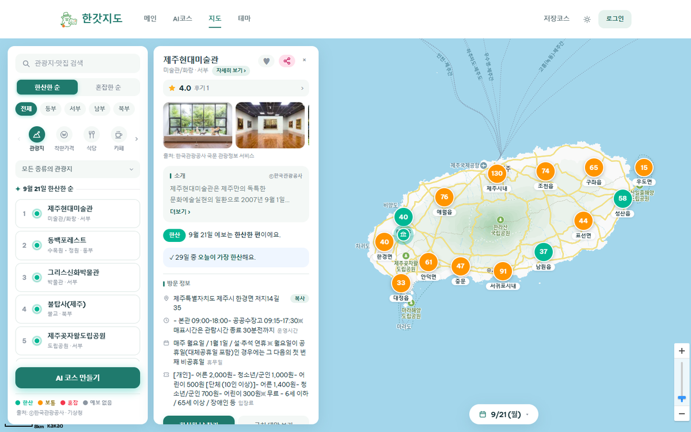
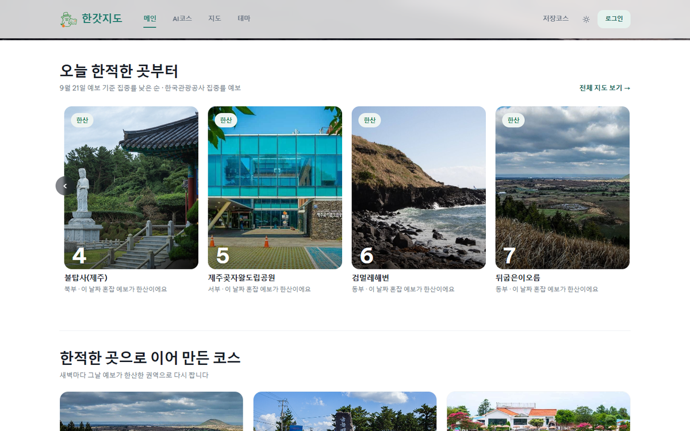
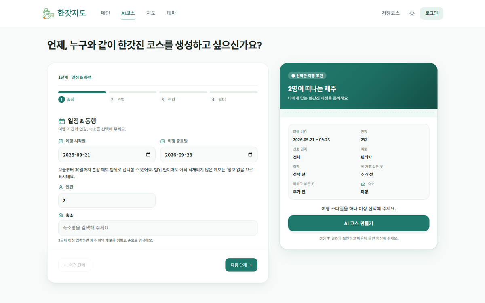
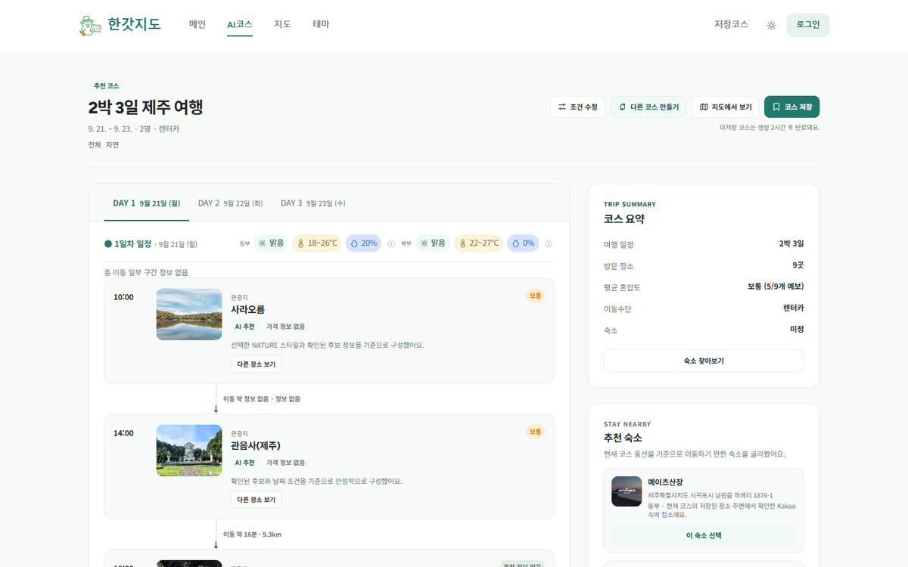
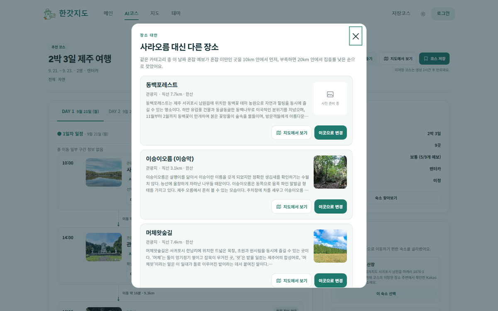
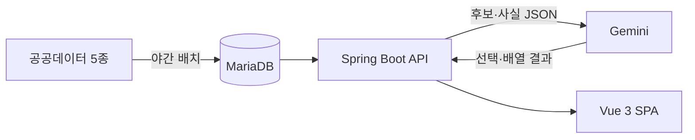
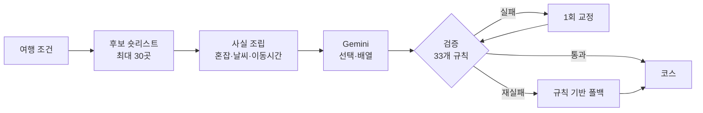

<div align="center">


# 한갓지도

**붐비는 날은 피하고, 한적한 관광지를 코스로 잇는 지도**

제주 관광지의 날짜별 혼잡도를 미리 읽어, 붐비는 명소 대신 한적한 대안을 이어 여행 코스를 설계합니다.

[](https://hangatjeju.com)


2026 관광데이터 활용 공모전 웹·앱 구현 부문 / 지정과제 2번 오버투어리즘 / 팀 제주선비

</div>

---

## 이런 문제를 풉니다

제주 관광객은 소수의 유명 명소와 성수기에 몰립니다. 방문객은 붐비는 곳에서 만족도가 떨어지고, 지역은 수용력 부담을 집니다.

한국관광공사는 관광지별 집중률(혼잡) 예보를 이미 개방하고 있지만, 여행자가 **계획 단계에서** 이를 체감할 수 있는 서비스가 없었습니다. 한갓지도는 혼잡이 발생한 뒤 피하는 실시간 대응 대신, **방문 전에 수요를 분산**하는 쪽을 택했습니다.

## 핵심 기능

| 해시태그 | 기능 | 화면 |
|---|---|---|
| `#혼잡도 분석` | 오늘부터 30일까지 날짜를 고르면 그 날짜의 관광지별 혼잡 단계(한산·보통·혼잡)를 지도 핀 색과 '한산한 순' 목록으로 | `/map` |
| `#과밀지역 우회` | 코스 안 장소를 같은 날짜 예보가 더 한산한 대안으로 원클릭 교체하고 동선을 재계산 | `/ai-course`, `/courses/:id` |
| `#숨은 명소` | 매일 새벽 그날 예보 기준 한적한 곳을 큐레이션하고, 그날 한산한 권역으로 기성 코스를 다시 생성 | `/`, `/themes` |
| `#코스 추천` | 혼잡 예보·기상청 날씨·실도로 이동시간을 사실 데이터로 묶어 일자별 코스를 생성하고 저장·QR 공유 | `/ai-course` |

부가 기능: 여행 확정 뒤 혼잡·비/눈 예보가 나빠지면 알림, 착한가격업소 검증가 레이어, 카카오 로그인, 후기·찜, 마이페이지.

## 화면

| 혼잡 예보 지도 | 장소별 날짜 예보 | 메인 추천 |
|:---:|:---:|:---:|
|  |  |  |
| 날짜를 고르면 관광지별 혼잡 단계가 핀 색과 목록에 반영됩니다 | 장소를 누르면 그 장소의 날짜별 예보와 한산한 날을 보여 줍니다 | 그날 예보 기준 한적한 곳과 권역별 기성 코스 |

| AI 코스 조건 입력 | AI 코스 생성 결과 | 대안 장소 교체 |
|:---:|:---:|:---:|
|  |  |  |
| 일정·인원·숙소·권역·이동수단·취향을 단계별로 | 일차별 일정에 권역 날씨와 장소별 혼잡 배지, 이동시간 | 같은 날짜 예보가 더 한산한 곳으로 교체 |

## 데이터를 다루는 원칙

서비스 전반에 적용한 규칙입니다. 코드 리뷰와 화면 문구 모두 이 기준으로 봅니다.

- **시간대(오전/오후) 단위 혼잡은 제공하지 않습니다.** 원천 데이터의 해상도가 날짜 단위까지입니다.
- **없는 값을 0으로 채우지 않습니다.** 예보가 없으면 '정보 없음', 예보 범위 밖이면 '기상청 예보 제공 범위 밖'으로 그대로 보여 줍니다.
- **수치는 전부 공공데이터에서 옵니다.** 생성형 AI는 주어진 후보 안에서 선택과 배열만 하고, 혼잡도·거리·날씨 숫자를 만들지 않습니다. 결과는 백엔드가 33개 규칙으로 검증합니다.
- **집중률은 장소별 상대값이라 장소 간 절대 비교를 하지 않습니다.** 같은 장소의 날짜별 비교에만 씁니다.
- **출처를 화면에 표기합니다.** 관광정보·사진 ⓒ한국관광공사, 날씨는 기상청 발표 시각까지 함께.

## 활용 공공데이터

| 데이터 | 제공 | 쓰임 | 갱신 |
|---|---|---|---|
| 국문 관광정보 서비스 (KorService2) | 한국관광공사 | 장소 마스터, 개요·이용시간·요금, 사진, 분류체계 | 매일 02:20 |
| 관광지 집중률 방문자 추이 예측 정보 | 한국관광공사 | 30일 혼잡 예보, 한산한 순 정렬, 코스 혼잡 회피 | 매일 03:00 |
| 단기예보·중기예보 조회서비스 | 기상청 | 권역별 날짜별 날씨, 우천 시 실내 우선 배치 | 매일 03:30·06:30 |
| 상가(상권)정보 | 소상공인시장진흥공단 | 지도의 카페·편의점·마트 핀 | 매일 02:20 |
| 착한가격업소 | 행정안전부 | 검증가 배지, 대표메뉴 가격 | 분기 |

적재 규모(2026-09-20 기준): 관광지 812곳, 혼잡 예보 340곳, 착한가격업소 271곳, 카페 3,249곳, 편의점 1,322곳, 마트 1,058곳.

## 기술 스택

| 영역 | 사용 기술 |
|---|---|
| 백엔드 | Java 17, Spring Boot 3.4.4, Spring Security + JWT, Spring Data JPA, Flyway, springdoc OpenAPI |
| 프론트엔드 | Vue 3.5, TypeScript 5.7, Vite 6, Pinia, Vue Router, Vitest |
| 데이터 | MariaDB 11.4, MinIO(이미지), 카카오맵 JS SDK |
| 외부 연동 | Kakao Mobility(실도로 경로), Kakao Local(숙소), Google Gemini(코스 배열) |
| 인프라 | Docker, Jenkins, Helm, k3s, Cloudflare |

## 아키텍처



화면은 언제나 DB를 조회합니다. 외부 API 호출은 야간 배치와 일부 실시간 조회(장소 검색, 경로, 날씨 폴백)로 한정해, 공공 API 장애가 화면을 비우지 않게 했습니다.

### AI 코스 생성 파이프라인



LLM에는 자체 DB에서 고른 후보와 확인된 사실만 넘어갑니다. 존재하지 않는 장소나 지어낸 수치는 검증 단계에서 걸러지고, 그래도 실패하면 같은 우천·혼잡 규칙을 쓰는 결정론적 폴백이 코스를 만듭니다.

## 야간 배치

| 잡 | 시각(KST) | 하는 일 |
|---|---|---|
| `places` | 02:20 | 관광지·상가·착한가격업소 재적재, 폐업 판정 |
| `congestion` | 03:00 | 집중률 예보 30일치 적재, 관광지명 매칭 |
| `weather` | 03:30, 06:30 | 권역별 날짜 단위 예보 적재 |
| `trip-weather` | 3시간마다 | 알림용 시간별 강수 예보 |
| `sample-courses` | 04:00 | 그날 한산한 권역으로 기성 코스 재생성 |
| `trip-reminders` | 매시 10분 | 확정 여행의 예보 변화 비교·알림 |

## 프로젝트 구조

```
HanGat_Map/
├── backend/                 Spring Boot API + 야간 배치
│   └── src/main/java/com/example/hangat/
│       ├── course/          AI 코스 생성·검증·폴백, 대안 스왑
│       ├── map/             장소 적재, 집중률, 착한가격, 상가
│       ├── domain/weather/  기상청 예보 적재
│       ├── notification/    여행 확정 알림
│       ├── user/ review/ favorite/
│       └── batch/ config/ common/
├── frontend/                Vue 3 SPA
│   └── src/
│       ├── views/           home · map · ai-course · place · theme · mypage
│       ├── services/        API 클라이언트, 코스·지도 도메인 로직
│       └── components/
└── cicd/                    Jenkinsfile, Helm 차트, Dockerfile
```

## 로컬 실행

### 사전 준비

```bash
git clone https://github.com/Jeju-Seonbi/HanGat_Map.git
cd HanGat_Map
cp backend/.env.example backend/.env    # 값은 팀 채널에서 받습니다
```

`backend/.env`에는 DB 접속 정보, 공공데이터포털 인증키, JWT 시크릿, 소셜 로그인 키가 들어갑니다. **이 파일은 절대 커밋하지 않습니다.**

### 백엔드

```bash
docker compose -f backend/docker-compose.yml up -d    # MariaDB 11.4
cd backend && ./gradlew bootRun --args='--spring.profiles.active=dev'
```

API 문서는 http://localhost:8080/swagger-ui/index.html 에서 볼 수 있습니다.

### 프론트엔드

```bash
cd frontend && npm ci && npm run dev
```

## 테스트

```bash
cd backend && ./gradlew test        # 903건
cd frontend && npm test             # 853건
cd frontend && npm run type-check   # vue-tsc
```

## 브랜치 규칙

`dev`에서 브랜치를 따고 PR로 병합합니다. 브랜치 이름은 CI가 검사하며 `feat/` `fix/` `refactor/` `docs/` `test/` `chore/` `ci/` `build/` `perf/` `style/` 중 하나로 시작해야 합니다.

## 팀

제주선비 - 개발자 4인

| 담당 | GitHub |
|---|---|
| 지도 · 장소 상세 · 후기 · 데이터 적재 | [@sarapoba](https://github.com/sarapoba) |
| AI 코스 조건 입력 · 생성 · 프롬프트 | [@sole0714](https://github.com/sole0714) |
| 메인 추천 · 코스 상세 · 대안 스왑 · 날씨 · 혼잡 코어 | [@DongHyunj](https://github.com/DongHyunj) |
| 회원 · 마이페이지 · 알림 · 인프라 · 배포 | [@Lumisia](https://github.com/Lumisia) |

## 고지

- 관광정보·사진 및 혼잡 예보: ⓒ한국관광공사 / 날씨: 기상청 / 착한가격업소: 행정안전부 / 상가정보: 소상공인시장진흥공단
- 혼잡 정보는 예측 자료이며 실제 혼잡과 다를 수 있습니다. 날씨는 기상청 예보 기준입니다.
- 본 서비스는 한국관광공사가 운영하지 않으며, 서비스 소유권은 개발 팀에 있습니다.
